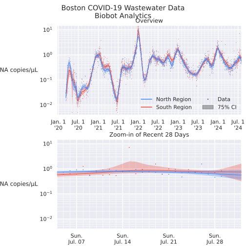
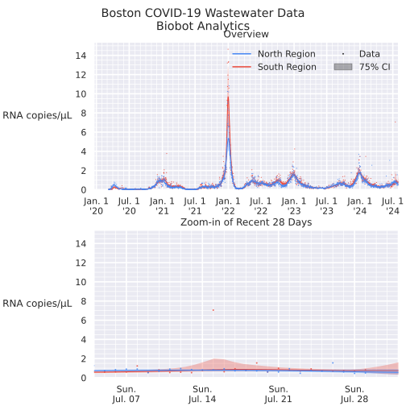

# Biobot Data Visualization

A few scripts for visualizing
the [COVID-19 wastewater data for the Boston area from Biobot Analytics](https://www.mwra.com/biobot/biobotdata.htm) in
a way that, subjectively, seems easier to read and better about communicating uncertainty bounds.

Before and after:

## After

(click to zoom)

[](https://raw.githubusercontent.com/peterdsharpe/better-biobot-boston/master/assets/after-log.svg)

## Before

(From [MWRA](https://www.mwra.com/biobot/biobotdata.htm))


## Changes

A list of changes compared to the MWRA visualization is here. The goal is for this to serve as a reference for things to
think about before releasing public-facing data visualizations:

* Replaced "1-week simple moving average" smoothing method with spline regression with bootstrapped resampling.
  Benefits:
	* No longer backwards-biased in time when estimating data for periods where forward-looking data exists.
	* Eliminates subjectively-chosen 1-week SMA period. (For data with no weekly periodic component, this choice of
	  period has no basis in the underlying data.)
	* Allows outlier identification based on a quantitative metric
	* Smooths the data based on a quantitative metric: the variance of measurement data between subsequent days.
* Drew 95% confidence interval based on bootstrapped data
	* Shows how uncertainty grows during time period where sampling was less frequent (e.g., May 2020), noisy (e.g., June 2021), or missing (e.g., the past few days or so, due to data lag).
	* Allows forecasting of future disease burden while communicating the increased uncertainty as the forecasting
	  interval grows
* Switched to a log scale, so that exponentially-growing or -shrinking disease burdens can be
  identified. [Infectious diseases are perhaps the single canonical example of mathematical phenomena that grow and shrink exponentially](https://en.wikipedia.org/wiki/Compartmental_models_in_epidemiology#The_SEIR_model)
  , so using a log-scale is much more relevant here.
	* A non-log-scale version is shown below, which may facilitate communication with audiences that are unfamiliar with
	  reading logarithmic graphs.
* Switched units to "RNA Copies per μL" rather than "per mL", which allows us to use units with fewer zeros (e.g., 2, 4,
  6, 8, 10; rather than 2000, 4000, 6000...).
	* This improves readability while losing no meaning, since the actual magnitude of this number is unimportant and
	  only the trends are interpreted.
* Adjusted drawing order so that data no longer obscures trendline
* Added a zoom-in window so that the most relevant data (i.e., the past month) is readable.
* Replaced colors with colorblind-friendly choices; the previous orange/green is one of [the least distinguishable color pairs](https://cdn-prod.medicalnewstoday.com/content/images/articles/319/319115/color-blindness.jpg) for folks with red-green colorblindness, which affects over 7% of men (i.e., almost as prevalent as left-handedness).

#### Non-log-scale Version

(click to zoom)

[](https://raw.githubusercontent.com/peterdsharpe/better-biobot-boston/master/assets/after.svg)

## Instructions to Run

Install dependencies:

```bash
pip install -r requirements.txt
```

Run:

```bash
python visualize.py
```
